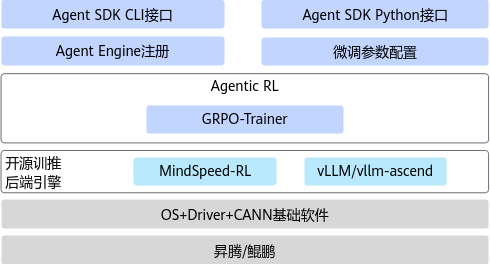

# 简介

Agent SDK用来帮助用户快速训练AI智能体。

-   多种轨迹生成方法，支持插件。
-   融合调度高效利用显存。

**使用导引**

如果第一次使用本软件，可以从[快速入门](quick_start.md#快速入门)中的样例开始上手，并确保按照其中步骤准备好相关环境和软件包。

如果对于相关流程已比较熟悉，可以直接跳转到[Python接口说明](./api_python.md#python接口说明)获取需要的函数接口，加速数据处理流程。

# 软件架构

Agent SDK软件架构如[图1](#fig173917397815)所示。

**图 1**  Agent SDK软件架构  

**表 1**  架构图模块介绍

|模块|说明|
|--|--|
|Agent SDK CLI接口|命令行接口。|
|Agent SDK Python接口|Python接口。|
|Agent Engine注册|实现Agent的定义和Agent引擎的配置注册。|
|微调参数配置|微调阶段RL（Reinforcement learning）相关参数配置信息，比如train_iters等参数。|
|Agentic RL|Agent RL微调的核心能力层，包括了Agent轨迹生成、多轮上下文记忆、分布式资源管理以及Agent训练推理运行时管理。|
|GRPO-Trainer|支持GRPO（Group Relative Policy Optimization）强化学习算法进行Agent RL微调。|

# 支持的硬件和操作系统

|产品系列|产品型号|操作系统版本|
|--|--|--|
|Atlas A2 训练系列产品|Atlas 800T A2 训练服务器|Ubuntu 22.04|

